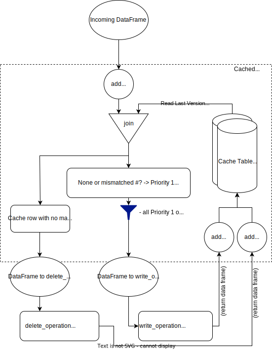

# ETL specializations

This area documents special classes that inherit from ETL base classes to 
solve specific generic tasks.

## Cache Loader

The Cache Loader is provided as `atc.cache.CacheLoader`. The cached loader 
passes only some rows on to the write operation, and not all. This can give 
optimizations for cases where the write operation is costly, such as writes 
to eventhub or cosmos. 

The following diagram illustrates the flow of data 
through the cached loader.

The foundation of the cached loader is a cache table that contains primary key 
columns and a hash for each row. 
The cached loader supports the following use-cases:
- write rows that are 
  - new wrt. the cache table
  - changed wrt. the cache table
  - unchanged, but old enough to merit a re-write to prevent timeout.
  - unchanged, but old enough to require a re-write (max_TTL feature)
- delete rows that are in the cache table but not in the data.

Use the class `atc.cache.CacheLoaderParameters` to configure all these features.
See the unittests for a full example for how to use the CachedLoader.
